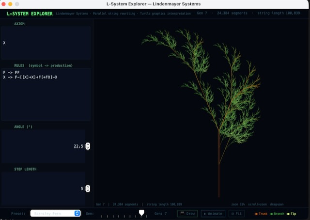

# L-System Explorer



An interactive Java Swing explorer for Lindenmayer Systems featuring 12 preset grammars, an editable rule editor, generation-by-generation animation, and depth-coloured turtle graphics rendering — from Koch snowflakes to stochastic ferns.

  

---

## What is an L-System?

An L-system (Lindenmayer system) is a formal grammar invented by biologist Aristid Lindenmayer in 1968 to model plant growth. It consists of three things:

- An **axiom** — the starting string
- A set of **production rules** — each symbol is simultaneously replaced by a string of other symbols
- An **angle** — used by a turtle graphics renderer to interpret the resulting string as a drawing

At each generation, every symbol in the current string is replaced in parallel. This parallel rewriting is what produces the self-similar, fractal-like structures — it mirrors the way biological cells divide simultaneously rather than one at a time.

The resulting string is interpreted as commands for a turtle (a drawing cursor with a position and heading):

| Symbol | Action |
|--------|--------|
| `F` | Move forward and draw a line |
| `G` | Move forward and draw a line (alternate) |
| `f` | Move forward without drawing |
| `+` | Turn left by the specified angle |
| `-` | Turn right by the specified angle |
| `\|` | Turn 180° (reverse direction) |
| `[` | Push current position and heading onto a stack |
| `]` | Pop position and heading from the stack |
| `<` | Decrease step length by 30% |
| `>` | Increase step length by 43% |
| `!` | Decrease line width |
| `;` | Increase line width |
| Any other letter | Variable — expanded by rules, ignored by the renderer |

The bracket pair `[` and `]` is the key to branching structures. `[` saves the turtle's state before a branch begins; `]` restores it when the branch ends, allowing the turtle to return to the branching point and continue in a different direction.

---

## Build & Run

Requires Java 17+.

```bash
git clone https://github.com/yourname/l-system-explorer
cd l-system-explorer
chmod +x build.sh && ./build.sh
java -jar LSystems.jar
```

---

## Interface

The window is divided into three sections:

**Grammar editor (left panel)**
- **Axiom** — the starting string for the expansion
- **Rules** — one rule per line in the format `F -> F+F-F-F+F`
- **Angle** — the turning angle in degrees used by `+` and `-`
- **Step length** — the distance the turtle moves per `F` command

**Drawing canvas (right)**
- Renders the L-system with depth-coloured lines: amber (deep/trunk) → green (mid branches) → bright yellow-green (tips)
- Mouse wheel to zoom, click and drag to pan
- **⊡ Fit** button resets to auto-fit

**Control bar (bottom)**
- **Preset dropdown** — 12 built-in grammars
- **Gen slider** — generation depth (0–8)
- **⬛ Draw** — expand and render immediately
- **▶ Animate** — draw the turtle path stroke by stroke with a progress bar
- **⊡ Fit** — reset zoom and pan

---

## Presets

| Preset | Description |
|--------|-------------|
| Koch Snowflake | Classic fractal curve; three copies form a snowflake |
| Koch Island | Square variant of the Koch curve |
| Sierpinski Triangle | Classic fractal triangle |
| Dragon Curve | Paper-folding fractal; no overlaps at any generation |
| Hilbert Curve | Space-filling curve that visits every cell in a grid |
| Simple Fern | Parametric fern with visible branching structure |
| Barnsley Fern | Slightly different angle — more realistic frond shape |
| Binary Tree | Symmetric branching tree |
| Symmetric Tree | Denser tree with natural-looking spread |
| Bush | Compact bush form with irregular branching |
| Stochastic Plant | Three competing rules chosen at random — different result every seed |
| Gosper Curve | Hexagonal space-filling curve (flowsnake) |

---

## Designing Your Own L-System

### Step 1: Choose a drawing symbol

`F` is the most common drawing symbol. Start with `F` as your axiom and one rule for `F`.

### Step 2: Write a rule

A rule takes the form `symbol -> replacement`. Every `F` in the current string is simultaneously replaced by the replacement string.

The simplest non-trivial example:

```
Axiom: F
Rule:  F -> F+F-F-F+F
Angle: 90
```

At generation 0 you see a single line. At generation 1 each `F` becomes `F+F-F-F+F` — a bent line that turns corners. At generation 4 you have the Koch curve.

### Step 3: Add variables

Letters other than `F`, `G`, `f` are variables — they expand but do not draw. They let you control the *structure* of the expansion independently of what gets drawn.

```
Axiom: X
Rule:  F -> FF
Rule:  X -> F+[[X]-X]-F[-FX]+X
Angle: 25
```

Here `X` controls the branching pattern; `F` controls how much the trunk grows. Separating these gives you much more expressive power.

### Step 4: Add branching with `[` and `]`

Any sub-string wrapped in `[` and `]` is a branch. The turtle saves its position and heading at `[`, draws the branch, then returns to the saved position at `]`.

```
F[+F][-F]     → draw forward, branch left, return, branch right
F[+F][-F][F]  → three branches at each node
```

Nesting brackets creates sub-branches:

```
F[+F[+F][-F]][-F[+F][-F]]
```

### Step 5: Tune the angle

The angle is one of the most powerful parameters. The same rule at different angles produces radically different results:

| Angle | Typical result |
|-------|---------------|
| 60° | Triangular / hexagonal forms |
| 72° | Pentagonal / star forms |
| 90° | Square / rectilinear forms |
| 25° | Natural-looking plant forms |
| 22.5° | Denser, more realistic foliage |
| 120° | Sierpinski-like triangular forms |

Small angle changes can transform a recognisable plant into a geometric abstraction.

### Step 6: Add stochastic variation

To create a different result each time, give the same symbol multiple rules. The program assigns equal probability to each:

```
Rule: F -> F[+F]F[-F]F
Rule: F -> F[+F]F
Rule: F -> F[-F]F
```

Each `F` in the expansion randomly selects one of these three rules. The overall form stays recognisable but no two runs are identical — much like real plants.

### Step 7: Control step scaling with `<` and `>`

`<` multiplies the step length by 0.7 (shorter steps). `>` multiplies by 1.43 (longer steps). Embedding these in rules lets branches get shorter as they become finer:

```
Rule: F -> F > [+F] < [-F] > F
```

---

## Worked Example: Building a Tree from Scratch

Start here and press **⬛ Draw** at each step to see the progression.

**Generation 0 — single line:**
```
Axiom: F
(no rules yet)
Angle: 25
```

**Add a simple branching rule:**
```
Axiom: F
Rule:  F -> FF+[+F-F-F]-[-F+F+F]
Angle: 22.5
```
At generation 4–5 this produces a recognisable symmetric tree.

**Add asymmetry:**
```
Rule: F -> FF+[+F-F-F]-[-F+F+F+F]
```
The extra `+F` on the right branch makes the tree lean slightly, looking more natural.

**Add stochastic variation:**
```
Rule: F -> FF+[+F-F-F]-[-F+F+F]
Rule: F -> FF-[-F+F+F]+[+F-F-F]
```
Now each branch independently picks which way to lean.

---

## Tips and Common Patterns

**Nothing drawing?** Check that your axiom contains at least one `F` or `G`. Variables alone produce no visible output.

**Screen fills immediately?** Reduce the generation count or reduce step length. Exponential string growth means generation 7+ can produce millions of segments for complex rules.

**Spiky / chaotic result?** Reduce the angle. Angles above 90° with recursive rules tend to produce tangled overlapping forms.

**Too symmetrical?** Introduce a small asymmetry in the rule — an extra `+` or one fewer `-` on one side — or add a second stochastic rule.

**All one colour?** The colour depth is driven by the stack depth (how many `[` brackets deep the current segment is). Rules with deep nesting produce the full amber → green → yellow-green gradient. Rules with no brackets at all render entirely in trunk colour.

**Want spiral forms?** Use rules where the number of `+` turns does not equal the number of `-` turns. The net rotation accumulates across generations.

---

## Project Structure

```
src/
  model/    LSystem          — grammar engine, expansion, turtle interpreter
  ui/       DrawPanel        — rendering canvas with zoom/pan/animation
            GrammarPanel     — editable rule editor
            MainFrame        — application assembly and controls
            Theme            — colour scheme
  main/     LSystemExplorer  — entry point
```

---

## Background

L-systems were introduced by Aristid Lindenmayer in *Mathematical models for cellular interaction in development* (1968). The turtle graphics interpretation and the connection to fractal geometry was developed extensively by Przemysław Prusinkiewicz and Lindenmayer in *The Algorithmic Beauty of Plants* (1990), which remains the definitive reference and is freely available online. Every preset in this program is drawn from that book.
